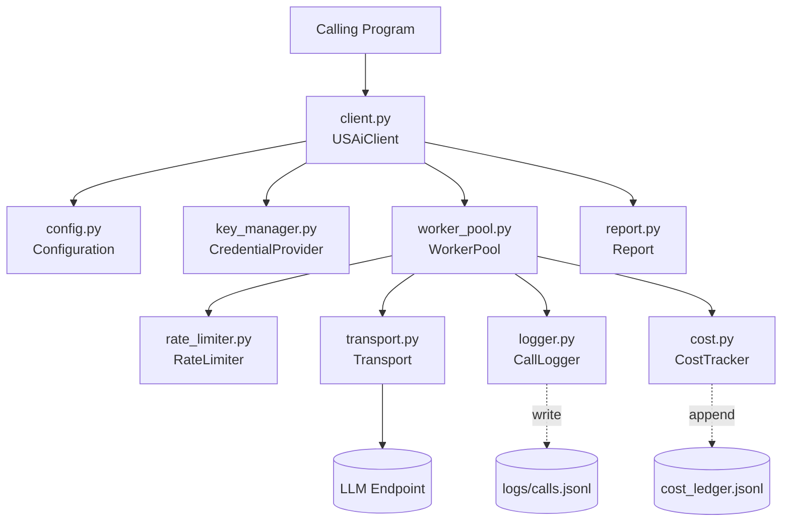
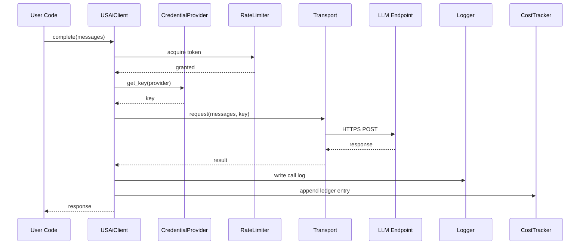
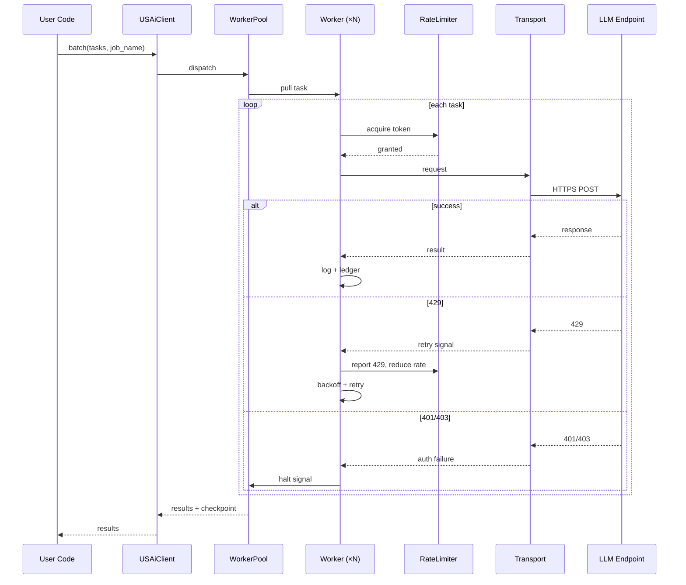

# Architecture — usai-harness

**Version:** 1.0
**Date:** 2026-04-24
**Status:** Baseline

## 1. Purpose

This document describes the internal architecture of the usai-harness. It covers component responsibilities, data flow for common operations, interface boundaries, and the threat model the design defends against. Functional behavior is specified in the SRS. Quality attributes are specified in the NFR.

## 2. System Context

The harness is a Python library imported by a calling program. It is not a service, has no open ports, and runs entirely in-process. Inputs are configuration files, credential sources, and task data passed by the caller. Outputs are LLM responses returned to the caller, plus on-disk artifacts (call log, cost ledger, reports).

```
┌──────────────────────────────────────────────────┐
│  Calling Program (notebook, script, pipeline)    │
│  ───────────────────────────────────────────────  │
│  from usai_harness import USAiClient             │
│  async with USAiClient(project=...) as c:        │
│      results = await c.batch(tasks)              │
└───────────────┬──────────────────────────────────┘
                │
                ▼
┌──────────────────────────────────────────────────┐
│  usai-harness library                            │
│  ──────────────────────────────────────────────   │
│  Client, Config, Credentials, Workers,           │
│  RateLimiter, Transport, Logger, Cost, Report    │
└───────────────┬──────────────────────────────────┘
                │
                ▼ HTTPS
┌──────────────────────────────────────────────────┐
│  LLM Provider (USAi, OpenRouter, Azure OpenAI)   │
└──────────────────────────────────────────────────┘
```

## 3. Component Overview

The harness is organized into nine modules, each with a narrow responsibility and explicit contract. `client.py` is the integration point. All other modules are usable and testable without it.



### 3.1 `client.py` — USAiClient

The single public entry point. Constructs and wires all other components. Exposes `complete()` and `batch()` as async methods and supports async context management for setup and teardown.

Holds no business logic of its own. Delegates rate limiting, transport, credentials, logging, and cost tracking to their respective modules. Its job is wiring and lifecycle.

### 3.2 `config.py` — Configuration

Loads `configs/models.yaml` and optional project configuration. Validates required fields, verifies provider and model references resolve, and normalizes configuration into typed structures used by the rest of the library.

Uses `yaml.safe_load` exclusively. Rejects invalid configuration at construction time rather than at call time.

### 3.3 `key_manager.py` — Credentials

Defines the `CredentialProvider` protocol and ships three implementations:

- `DotEnvProvider` reads from `.env`. Resolution order is project-local `.env`, then user-level `.env` in the per-user configuration directory, then OS environment variables. The user-level location is `~/.config/usai-harness/.env` on Linux and macOS, and `%APPDATA%\usai-harness\.env` on Windows. One rotation of the user-level file propagates to every project using the harness on that machine.
- `EnvVarProvider` reads from OS environment variables directly. Suited to CI, containers, and orchestrator-managed environments.
- `AzureKeyVaultProvider` reads from Azure Key Vault (optional install).

The protocol exposes one method: `get_key(provider: str) -> str`. Providers do not track expiry or freshness. Authentication validity is determined by endpoint response (ADR-002).

### 3.4 `transport.py` — Transport Layer

Defines the transport contract and ships two implementations:

- `HttpxTransport` uses `httpx` to call OpenAI-compatible endpoints directly.
- `LiteLLMTransport` wraps LiteLLM for environments that permit it (optional install).

Transports are selected per project via configuration. New transports can be added without changes to any other module (ADR-001).

### 3.5 `rate_limiter.py` — Rate Limiter

Token bucket rate limiter shared across all workers in a pool. Per-provider parameters are sourced from configuration. Adaptive backoff reduces the refill rate on HTTP 429 and recovers on sustained success (ADR-006).

### 3.6 `worker_pool.py` — Worker Pool

Pool of N async workers that pull tasks from a queue, acquire tokens from the rate limiter, call the transport, and write results to the logger and cost tracker. Applies retry with exponential backoff for transient errors. Halts the pool on authentication failures and unrecoverable errors.

### 3.7 `logger.py` — Call Log

Writes one JSONL entry per call to the call log. Flushes after each write. Applies secret redaction before emitting any content to disk or stderr (ADR-007).

Content logging (full prompts and responses) is off by default. The default entry contains metadata only (ADR-004).

### 3.8 `cost.py` — Cost Tracker

Accumulates per-call token counts, applies rates from the model configuration, and appends entries to `cost_ledger.jsonl`. The ledger dataclass has no content field, which structurally prevents content leakage through the cost ledger (ADR-004, ADR-007).

### 3.9 `report.py` — Report

Produces the post-run summary at the end of a batch. Provides the `usai-harness cost-report` and `usai-harness audit` CLI subcommands. The `ping`, `verify`, `init`, `add-provider`, and `discover-models` subcommands are also registered through this module.

## 4. Data Flow

### 4.1 Single call



### 4.2 Batch execution



### 4.3 Authentication failure handling

On HTTP 401 or 403:

1. The worker records the failure and signals the pool.
2. The pool stops accepting new tasks and cancels in-flight workers cleanly.
3. Checkpoint state (completed tasks, partial results) is preserved on disk.
4. A clear error is raised to the caller instructing credential refresh.
5. The caller can resume the batch after refreshing credentials.

This is the reactive authentication behavior specified in ADR-002 and FR-011.

## 5. Interfaces

### 5.1 Public API

```python
from usai_harness import USAiClient

async with USAiClient(project: str, config_path: str | None = None) as client:
    # Single call
    response = await client.complete(
        messages: list[dict],
        model: str | None = None,
        **params,
    )

    # Batch
    results = await client.batch(
        tasks: list[dict],
        job_name: str,
        log_content: bool = False,
    )
```

### 5.2 Transport contract

```python
class Transport(Protocol):
    async def request(
        self,
        provider: str,
        model: str,
        messages: list[dict],
        api_key: str,
        **params,
    ) -> TransportResponse:
        ...
```

`TransportResponse` carries the model's output, the model identifier returned by the endpoint, token counts, and error information if the call failed.

### 5.3 Credential contract

```python
class CredentialProvider(Protocol):
    def get_key(self, provider: str) -> str:
        ...
```

Backends are selected by project configuration. The default is `DotEnvProvider`.

### 5.4 Configuration schema

Model configuration (`configs/models.yaml`):

```yaml
providers:
  usai:
    base_url: https://usai.example.gov/v1
    api_key_env: USAI_API_KEY
    rate:
      refill_per_sec: 2.8
      burst: 3
  openrouter:
    base_url: https://openrouter.ai/api/v1
    api_key_env: OPENROUTER_API_KEY
    rate:
      refill_per_sec: 10
      burst: 20

models:
  llama-4-maverick:
    provider: usai
    input_rate_per_1k: 0.0
    output_rate_per_1k: 0.0
```

Project configuration (optional):

```yaml
credentials:
  backend: dotenv  # dotenv | envvar | azure_keyvault
  # Azure-specific fields when backend: azure_keyvault
  vault_url: https://my-vault.vault.azure.net

transport: httpx   # httpx | litellm

workers: 3
```

### 5.5 CLI

```
usai-harness init                      # first-run setup, writes to user-level .env, verifies end-to-end
usai-harness add-provider NAME         # register an additional provider (NAME is the provider identifier)
usai-harness discover-models [NAME]    # refresh model catalog from endpoint for a provider or all
usai-harness verify                    # end-to-end health check of all configured providers
usai-harness ping                      # minimal single-call check against default provider
usai-harness cost-report               # aggregate ledger entries
usai-harness audit                     # check gitignore, scan for tracked secrets, pip-audit
```

The `init` and `add-provider` commands capture API keys using `getpass.getpass()` to avoid terminal echo and shell-history capture. Commands that modify configuration write to the user-level location established in ADR-008. Commands that read configuration use the resolution order defined in FR-009a.

## 6. Threat Model

The harness defends against the following threat classes. Each is matched to a mitigation specified in an ADR or SEC requirement.

**T-1: Key exposure through logs.**
API keys appearing in call logs, stack traces, or error messages written to disk.
*Mitigations:* Secret redaction in all log paths (SEC-001, ADR-007). Metadata-only default logging (FR-027).

**T-2: Key exposure through version control.**
Credentials accidentally committed to git.
*Mitigations:* Gitignore coverage for `.env` and derived files (SEC-005). `usai-harness audit` scans for tracked secrets (FR-035).

**T-3: Content leakage through cost ledger.**
Prompts or responses ending up in the ledger, where they would be subject to retention and review policies.
*Mitigations:* Ledger dataclass has no content field. Structural, not conventional (FR-031, ADR-004).

**T-4: Code execution through crafted configuration.**
Malicious YAML content triggering code execution during parsing.
*Mitigations:* `yaml.safe_load` exclusively (SEC-002, ADR-007).

**T-5: Man-in-the-middle via disabled TLS.**
User disables TLS verification for convenience and forgets to re-enable.
*Mitigations:* TLS verification enforced by default. Warning on stderr every call if disabled (SEC-003, ADR-007).

**T-6: Silent model substitution.**
Endpoint routes to a different model than requested (provider-side failover, misconfiguration).
*Mitigations:* Model echo check compares `model_requested` and `model_returned`, flags mismatches in post-run report (FR-029, ADR-007).

**T-7: Supply-chain compromise through dependencies.**
A compromised dependency introducing malicious code during install.
*Mitigations:* Three hard dependencies, each broadly audited (ADR-005). Hash-pinned lockfile for reproducible installs (SEC-006). `pip-audit` via `usai-harness audit` (FR-035).

**T-8: Quiet key expiry.**
A key expires mid-batch, producing many failed calls before the user notices.
*Mitigations:* Reactive authentication halts on first 401/403 (ADR-002, FR-011). Checkpoint state preserved for clean resume after refresh (FR-005).

### Out of scope

The harness does not defend against:

- Compromised provider endpoints. TLS and key rotation reduce but do not eliminate this risk.
- Malicious input in user-supplied task content. Prompt injection is a workload-level concern.
- Compromised local development environments. Host security is assumed.
- Side-channel analysis of timing or token counts. Not a defensive goal of this library.

## 7. Design Constraints and Rationale

The architecture is shaped by constraints documented in the ADRs. In summary:

- **Transport pluggability** (ADR-001) accommodates environments where LiteLLM is unavailable or outdated.
- **Reactive authentication** (ADR-002) eliminates state files and backend-specific freshness logic.
- **Credential backend pluggability** (ADR-003) accommodates `.env`, environment variables, Azure Key Vault, and future backends without code changes.
- **Append-only ledger with metadata-only default** (ADR-004) makes PII exposure through cost accounting structurally impossible.
- **Minimal dependency surface** (ADR-005) keeps the library installable in restrictive environments.
- **Token bucket with adaptive backoff** (ADR-006) balances throughput against rate-limit compliance across diverse providers.
- **Security by default** (ADR-007) removes the burden of safe configuration from the casual user.
- **User-level credential storage** (ADR-008) provides a single key location that propagates across projects on a machine, with project-local override available.
- **Setup via endpoint discovery** (ADR-009) eliminates brittle hardcoded model identifiers by making the endpoint authoritative.

These decisions produce a library that is small, portable, auditable, and usable across federal environments with varying constraints.
